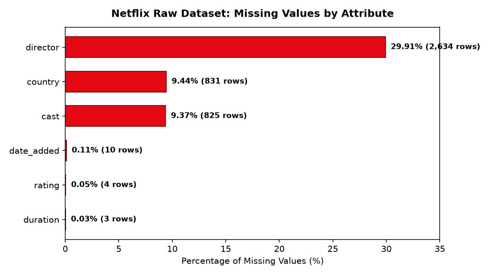
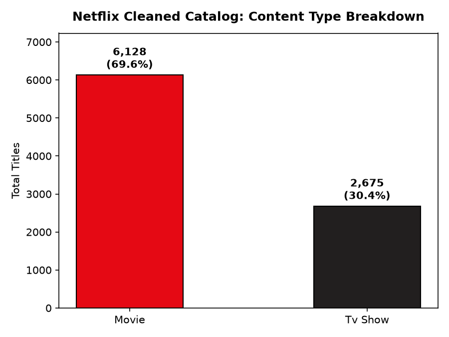
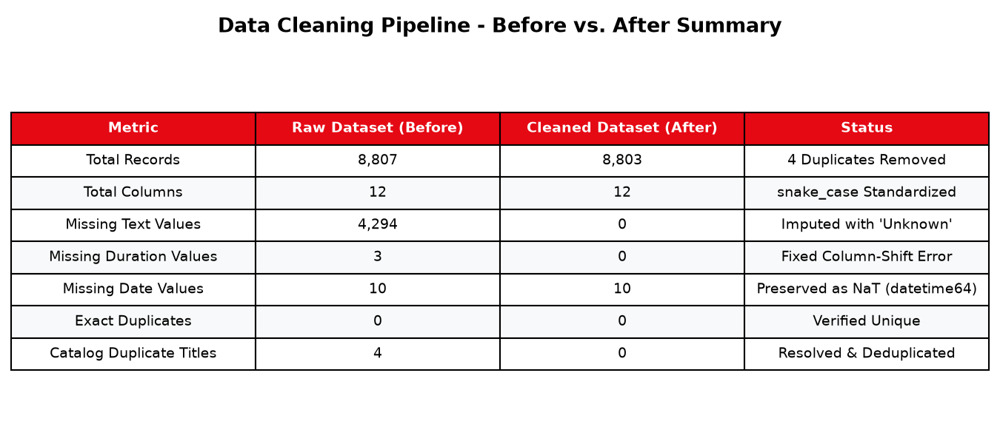

# Project Visualizations & Screenshots

This directory contains visual outputs, diagnostic charts, and summary graphics produced during the data cleaning process for **Task 1: Data Cleaning and Preprocessing**.

---

## 1. Missing Values Analysis (Raw Dataset)


- **Description:** Illustrates the percentage and raw volume of missing values across all impacted attributes in the raw `netflix_titles.csv` dataset prior to treatment.
- **Key Finding:** `director` exhibited the highest null rate (29.91%), followed by `country` (9.44%) and `cast` (9.37%). All were treated with domain-specific imputation.

---

## 2. Cleaned Catalog Content Type Distribution


- **Description:** Displays the proportion of **Movies** vs. **TV Shows** in the cleaned, deduplicated Netflix catalog.
- **Breakdown:** 
  - **Movies:** 6,128 titles (69.6%)
  - **TV Shows:** 2,675 titles (30.4%)
  - **Total:** 8,803 distinct titles

---

## 3. Before vs. After Cleaning Summary Infographic


- **Description:** High-level executive scorecard contrasting the dataset metrics before vs. after applying the pipeline.

---

## How to Re-generate Visualizations
These visualizations are automatically generated when executing the notebook:
```bash
jupyter execute notebooks/Task_1_Data_Cleaning.ipynb
```
or by running the cleaning pipeline script in `src/data_cleaning.py`.

